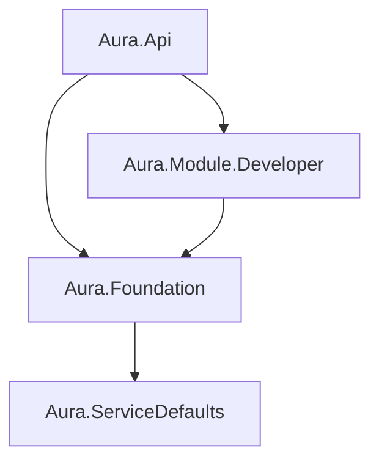

# Copilot CLI Parity

**Status:** Proposed  
**Priority:** High  
**Estimated Effort:** 5-7 days  
**Created:** 2026-01-15  
**Updated:** 2026-01-15

## Overview

Add key capabilities demonstrated by GitHub Copilot CLI to achieve feature parity for autonomous development workflows. Based on Scott Hanselman's demo of upgrading a legacy WPF app entirely via CLI with minimal manual intervention.

## Strategic Value

Copilot CLI demonstrated that developers want:

1. **Less friction** - Don't interrupt me for every approval
2. **Smart loops** - Build → Fix → Rebuild until success
3. **Visual understanding** - Show me the architecture
4. **CI/CD awareness** - Integrate with my pipeline

Aura already has strong foundations (RAG, code graph, tool framework, agents). This spec adds the **autonomy and loop constructs** that make these foundations truly powerful.

## Features

### Feature 1: Autonomous Execution Mode

**Problem:** Every workflow step requires manual approval, which is safe but slow.

**Solution:** Add execution modes that let users opt into varying levels of autonomy.

#### Execution Modes

| Mode | Description | Use Case |
|------|-------------|----------|

| `assisted` | Approve each step (current default) | Learning, sensitive changes |
| `autonomous` | Auto-approve safe steps, pause on dangerous | Routine development |
| `full-autonomous` | Auto-approve everything (YOLO mode) | Trusted automation, CI |

#### Definition of "Safe" vs "Dangerous"

- **Safe:** file.read, file.list, git.status, roslyn.validate, search operations
- **Dangerous:** file.write, file.delete, git.commit, git.push, shell.execute

This maps to existing `requiresConfirmation` in tool definitions.

#### API Changes

```http
POST /api/developer/workflows
{
  "description": "Add caching to UserService",
  "executionMode": "autonomous"  // NEW: "assisted" | "autonomous" | "full-autonomous"
}
```

```http
POST /api/developer/workflows/{id}/execute-all
# NEW endpoint: Execute all pending steps according to workflow's executionMode
```

#### Data Model Changes

```csharp
// WorkflowEntity.cs
public enum ExecutionMode
{
    Assisted,           // Default - approve each step
    Autonomous,         // Auto-approve steps with requiresConfirmation=false
    FullAutonomous      // Auto-approve all steps (YOLO)
}

public class WorkflowEntity
{
    // ... existing fields ...
    public ExecutionMode ExecutionMode { get; set; } = ExecutionMode.Assisted;
}
```

#### Extension UI Changes

- Add mode selector dropdown in "Create Workflow" panel
- Show clear warning for `full-autonomous` mode
- Display mode badge on workflow in tree view
- Add "Execute All" button that respects execution mode

---

### Feature 2: Build-Fix Loop

**Problem:** When code changes cause build errors, users must manually:

1. See the error
2. Ask agent to fix
3. Rebuild
4. Repeat

**Solution:** Add a `BuildFixLoop` tool that automates this cycle.

#### New Tool: `dotnet.build_until_success`

```yaml
toolId: dotnet.build_until_success
name: Build Until Success
description: |
  Iteratively builds the project, analyzes errors, applies fixes, and rebuilds
  until success or max iterations reached.
inputSchema:
  type: object
  properties:
    projectPath:
      type: string
      description: Path to .csproj or .sln file
    maxIterations:
      type: integer
      default: 5
      description: Maximum fix attempts before giving up
    includeWarningsAsErrors:
      type: boolean
      default: false
      description: Treat warnings as errors that need fixing
```

#### Implementation Flow

```text
┌─────────────────────────────────────────────────────────┐
│                   BuildFixLoop                          │
├─────────────────────────────────────────────────────────┤
│  1. Run `dotnet build`                                  │
│  2. Parse output for errors                             │
│  3. If success → return ✅                              │
│  4. If errors:                                          │
│     a. Format errors for LLM                            │
│     b. Call build-fixer-agent with error context        │
│     c. Apply suggested fixes via file.modify            │
│     d. Increment iteration counter                      │
│     e. If < maxIterations → goto 1                      │
│     f. Else → return ❌ with remaining errors           │
└─────────────────────────────────────────────────────────┘
```

#### Integration with Existing Agents

The loop uses the existing `build-fixer-agent.md`:

- Passes build output as `context.BuildOutput`
- Passes current file content as `context.CurrentCode`
- Agent returns fixes which are applied via `file.modify`

#### Similar Loops for Other Languages

| Tool | Language | Build Command |
|------|----------|---------------|

| `dotnet.build_until_success` | C#/F# | `dotnet build` |
| `cargo.build_until_success` | Rust | `cargo build` |
| `npm.build_until_success` | TypeScript | `npm run build` |
| `go.build_until_success` | Go | `go build ./...` |
| `python.check_until_success` | Python | `mypy` or `ruff check` |

---

### Feature 3: Architecture Visualization

**Problem:** Developers want to understand codebase structure visually.

**Solution:** Add tools that generate ASCII and Mermaid diagrams from code graph data.

#### New Tools

##### `graph.visualize_dependencies`

```yaml
toolId: graph.visualize_dependencies
name: Visualize Project Dependencies
description: Generate a diagram showing project/package dependencies
inputSchema:
  type: object
  properties:
    format:
      type: string
      enum: [ascii, mermaid]
      default: mermaid
    scope:
      type: string
      enum: [projects, packages, all]
      default: projects
```

**Example Output (Mermaid):**



##### `graph.visualize_class_hierarchy`

```yaml
toolId: graph.visualize_class_hierarchy
name: Visualize Class Hierarchy
description: Generate inheritance/implementation diagram for a type
inputSchema:
  type: object
  properties:
    typeName:
      type: string
      description: Name of the type to visualize
    format:
      type: string
      enum: [ascii, mermaid]
      default: mermaid
    depth:
      type: integer
      default: 3
      description: How many levels of inheritance to show
```

##### `graph.visualize_call_graph`

```yaml
toolId: graph.visualize_call_graph
name: Visualize Call Graph
description: Generate a diagram showing method call relationships
inputSchema:
  type: object
  properties:
    methodName:
      type: string
    direction:
      type: string
      enum: [callers, callees, both]
      default: both
    depth:
      type: integer
      default: 2
    format:
      type: string
      enum: [ascii, mermaid]
      default: mermaid
```

#### Extension Integration

- Render Mermaid diagrams in a webview panel
- Add "Visualize" context menu on types/methods in tree views
- Chat can return diagrams that render inline

---

### Feature 4: GitHub Actions Integration

**Problem:** No awareness of CI/CD pipelines or ability to manage them.

**Solution:** Extend `GitHubService` with Actions capabilities.

#### New Tools

##### `github.list_workflows`

```yaml
toolId: github.list_workflows
name: List GitHub Workflows
description: List all GitHub Actions workflows in the repository
```

##### `github.get_workflow_runs`

```yaml
toolId: github.get_workflow_runs
name: Get Workflow Runs
description: Get recent runs for a workflow
inputSchema:
  type: object
  properties:
    workflowName:
      type: string
    status:
      type: string
      enum: [all, success, failure, in_progress]
    limit:
      type: integer
      default: 10
```

##### `github.trigger_workflow`

```yaml
toolId: github.trigger_workflow
name: Trigger Workflow
description: Dispatch a workflow_dispatch event to trigger a workflow
inputSchema:
  type: object
  properties:
    workflowName:
      type: string
    ref:
      type: string
      default: main
    inputs:
      type: object
      description: Workflow inputs (if any)
requiresConfirmation: true
```

##### `github.create_workflow`

```yaml
toolId: github.create_workflow
name: Create GitHub Actions Workflow
description: Create a new GitHub Actions workflow YAML file
inputSchema:
  type: object
  properties:
    name:
      type: string
    triggers:
      type: array
      items:
        type: string
      description: e.g., ["push", "pull_request", "workflow_dispatch"]
    jobs:
      type: object
      description: Job definitions
```

##### `github.get_run_logs`

```yaml
toolId: github.get_run_logs
name: Get Workflow Run Logs
description: Retrieve logs from a specific workflow run
inputSchema:
  type: object
  properties:
    runId:
      type: integer
```

#### Implementation

Extend existing [GitHubService.cs](src/Aura.Module.Developer/GitHub/GitHubService.cs):

```csharp
public interface IGitHubService
{
    // Existing
    Task<Result<PullRequest>> CreatePullRequestAsync(...);
    
    // New - Actions
    Task<Result<IReadOnlyList<Workflow>>> ListWorkflowsAsync(string owner, string repo, CancellationToken ct);
    Task<Result<IReadOnlyList<WorkflowRun>>> GetWorkflowRunsAsync(string owner, string repo, string workflowId, CancellationToken ct);
    Task<Result<WorkflowRun>> TriggerWorkflowAsync(string owner, string repo, string workflowId, string @ref, Dictionary<string, string>? inputs, CancellationToken ct);
    Task<Result<string>> GetRunLogsAsync(string owner, string repo, long runId, CancellationToken ct);
}
```

---

### Feature 5: General Shell Tool

**Problem:** Language-specific tools exist, but no general-purpose shell for arbitrary commands.

**Solution:** Register a general `shell.execute` tool available to all agents.

#### Tool Definition

```yaml
toolId: shell.execute
name: Execute Shell Command
description: |
  Run an arbitrary shell command. Use for commands not covered by specific tools.
  Command runs in the workspace directory.
inputSchema:
  type: object
  properties:
    command:
      type: string
      description: The command to execute
    workingDirectory:
      type: string
      description: Directory to run in (defaults to workspace root)
    timeout:
      type: integer
      default: 60
      description: Timeout in seconds
requiresConfirmation: true  # Always require confirmation for arbitrary commands
categories:
  - shell
  - dangerous
```

#### Safety Considerations

- Always `requiresConfirmation: true`
- In `autonomous` mode, shell.execute still requires approval
- Only in `full-autonomous` mode does it auto-approve
- Log all executed commands for audit

---

## Implementation Plan

### Phase 1: Autonomous Execution Mode (Day 1-2)

1. Add `ExecutionMode` enum and property to `WorkflowEntity`
2. Add EF migration for new column
3. Update workflow creation endpoint to accept `executionMode`
4. Add `/api/developer/workflows/{id}/execute-all` endpoint
5. Update step execution to check workflow's execution mode
6. Extension: Add mode selector to create workflow panel
7. Extension: Add "Execute All" button

### Phase 2: Build-Fix Loop (Day 2-3)

1. Create `BuildFixLoopTool` in `Aura.Module.Developer/Tools/`
2. Implement build output parsing (errors, warnings, file/line)
3. Integrate with `build-fixer-agent.md` via ReAct executor
4. Add `dotnet.build_until_success` tool registration
5. Add similar tools for Rust, TypeScript, Go, Python
6. Add to language YAML configs

### Phase 3: Architecture Visualization (Day 3-4)

1. Create `VisualizationTools.cs` with diagram generators
2. Implement ASCII diagram rendering (simple box/arrow)
3. Implement Mermaid diagram generation
4. Register `graph.visualize_*` tools
5. Extension: Add Mermaid webview renderer
6. Extension: Add "Visualize" commands

### Phase 4: GitHub Actions Integration (Day 4-5)

1. Extend `IGitHubService` with Actions methods
2. Implement using Octokit (already a dependency)
3. Create `GitHubActionsTools.cs` to register tools
4. Add tools to tool registry
5. Test with real GitHub repo

### Phase 5: General Shell Tool (Day 5)

1. Create `ShellTools.cs` in `Aura.Foundation/Tools/`
2. Implement with proper timeout and output capture
3. Register as `shell.execute`
4. Ensure confirmation flow works correctly

---

## Success Criteria

1. **Autonomous Mode:** User can create a workflow in "autonomous" mode and steps auto-execute without approval for safe operations
2. **Build Loop:** `dotnet.build_until_success` can fix 3+ compilation errors in a loop
3. **Visualization:** `graph.visualize_dependencies` produces valid Mermaid diagram for Aura solution
4. **GitHub Actions:** Can list workflows and trigger a workflow_dispatch
5. **Shell:** Agent can run arbitrary commands with confirmation prompt

## Out of Scope

- Voice control (Copilot CLI demo used this)
- Browser integration
- Package manager integration (npm publish, nuget push)
- Deterministic upgrade tools (.NET Upgrade Assistant) - future spec

## Dependencies

- Existing tool framework (ReAct executor, tool registry)
- Existing GitHub service (`GitHubService.cs`)
- Existing build-fixer-agent
- Octokit library (already included)

## References

- [Copilot CLI Demo Notes](internal reference)
- [ADR-012: Tool-Using Agents](../../adr/012-tool-using-agents.md)
- [Feature: Tool Execution](../completed/tool-execution-for-agents.md)
- [Build Fixer Agent](../../../agents/build-fixer-agent.md)
