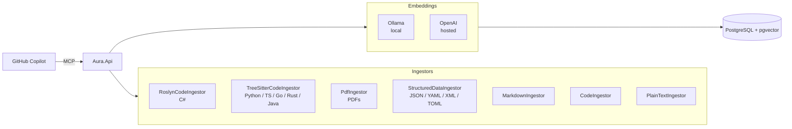

# Aura — Personal Knowledge MCP Server

[](https://github.com/johnazariah/aura/actions/workflows/ci.yml)
[](https://opensource.org/licenses/MIT)

Aura is a local indexing platform that makes your code, documents, PDFs, and config files semantically searchable by GitHub Copilot via MCP. It runs as a Windows Service or standalone process, indexing content through Roslyn (C#), TreeSitter (Python, TypeScript, Go, Rust, Java), and pdftotext (PDFs). Embeddings are generated locally via Ollama or hosted via OpenAI, with all data stored in PostgreSQL/pgvector on your machine.

## Architecture



## MCP Tools

| Tool | Description |
|------|-------------|
| `aura_search` | Semantic search across indexed content |
| `aura_navigate` | Find callers, implementations, derived types, usages |
| `aura_inspect` | Examine type members, class listings, project structure |
| `aura_refactor` | Rename, change signatures, extract methods/interfaces |
| `aura_generate` | Create types, implement interfaces, generate tests |
| `aura_validate` | Check compilation, run tests |
| `aura_index` | Trigger on-demand indexing of files and directories |
| `aura_workspace` | Register, list, and manage workspaces |
| `aura_tree` | Explore codebase hierarchy, retrieve source for nodes |
| `aura_architect` | Analyze dependencies, layer violations, public API surface |

## Supported Content

| Ingestor | File Types | Engine |
|----------|-----------|--------|
| RoslynCodeIngestor | `.cs` | Roslyn |
| TreeSitterCodeIngestor | `.py`, `.ts`, `.tsx`, `.js`, `.jsx`, `.go`, `.rs`, `.java`, `.c`, `.cpp`, `.h` | TreeSitter |
| PdfIngestor | `.pdf` | pdftotext |
| StructuredDataIngestor | `.json`, `.yaml`, `.yml`, `.xml`, `.toml` | Built-in parsers |
| MarkdownIngestor | `.md` | Built-in |
| CodeIngestor | Common source files (fallback) | Regex chunking |
| PlainTextIngestor | `.*` (catch-all) | Line splitting |

## Quick Start

### Prerequisites

- [.NET 10 SDK](https://dotnet.microsoft.com/download)
- [Ollama](https://ollama.ai/) with an embedding model (e.g. `ollama pull nomic-embed-text`)
- PostgreSQL with the [`pgvector`](https://github.com/pgvector/pgvector) extension

### Install the service

```powershell
# Build and deploy to C:\Program Files\Aura
.\scripts\Deploy-Dev.ps1
```

### Verify health

```powershell
curl http://localhost:5300/health
```

### Register a workspace

Add to your repo's `.vscode/mcp.json` (or `~/.copilot/mcp-config.json` for machine-wide):

```json
{
  "mcp": {
    "servers": {
      "aura": {
        "url": "http://localhost:5300/mcp"
      }
    }
  }
}
```

Then in Copilot:

```
@aura /workspace add --path C:\your\project --alias my-project
@aura /index --path C:\your\project
```

## Configuration

Edit `appsettings.json` in the install directory or set environment variables.

### Embedding provider

The `Embedding:Provider` setting controls which embedding backend is used:

| Value | Behavior |
|-------|----------|
| `auto` (default) | Try OpenAI first, fall back to Ollama |
| `ollama` | Local embeddings only via Ollama |
| `openai` | Hosted embeddings only via OpenAI |

```json
{
  "Embedding": {
    "Provider": "auto",
    "Dimensions": 768
  }
}
```

### Key settings

| Setting | Default | Description |
|---------|---------|-------------|
| `Embedding:Provider` | `auto` | Embedding backend (`auto`, `ollama`, `openai`) |
| `Embedding:Dimensions` | `768` | Vector dimensions (must match model) |
| `Ollama:BaseUrl` | `http://localhost:11434` | Ollama endpoint |
| `Ollama:EmbeddingModel` | `nomic-embed-text` | Ollama model name |
| `OpenAi:ApiKey` | — | OpenAI API key (required for `openai`/`auto`) |
| `OpenAi:EmbeddingModel` | `text-embedding-3-small` | OpenAI model name |

## Development

```powershell
# Build
dotnet build

# Run all unit tests
.\scripts\Run-UnitTests.ps1

# Run a single test class
dotnet test --filter "FullyQualifiedName~TokenTrackerTests"

# Lint / format check
dotnet format --verify-no-changes

# Run locally (without service install)
dotnet run --project src/Aura.Api

# Deploy to local service
.\scripts\Deploy-Dev.ps1
```

## Project Structure

```text
src/
├── Aura.Foundation/          # Core: embeddings, RAG, data, shell, git
├── Aura.Module.Developer/    # Roslyn + TreeSitter code intelligence
├── Aura.Module.Researcher/   # PDF and document ingestion
├── Aura.Api/                 # HTTP + MCP host
├── Aura.ServiceDefaults/     # Shared service configuration
└── Aura.Tray/                # Cross-platform system tray app (Avalonia)

tests/
├── Aura.Foundation.Tests/
├── Aura.Module.Developer.Tests/
├── Aura.Module.Researcher.Tests/
└── Aura.Api.Tests/
```

## License

MIT — see [LICENSE](LICENSE).
