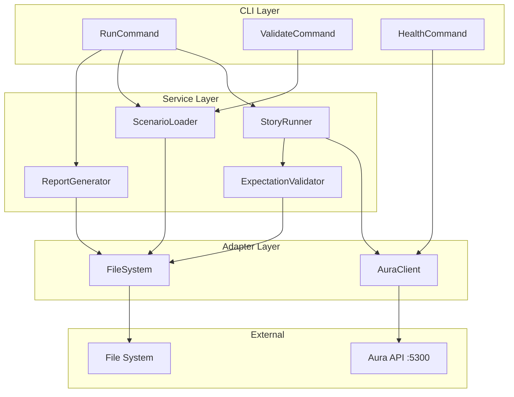
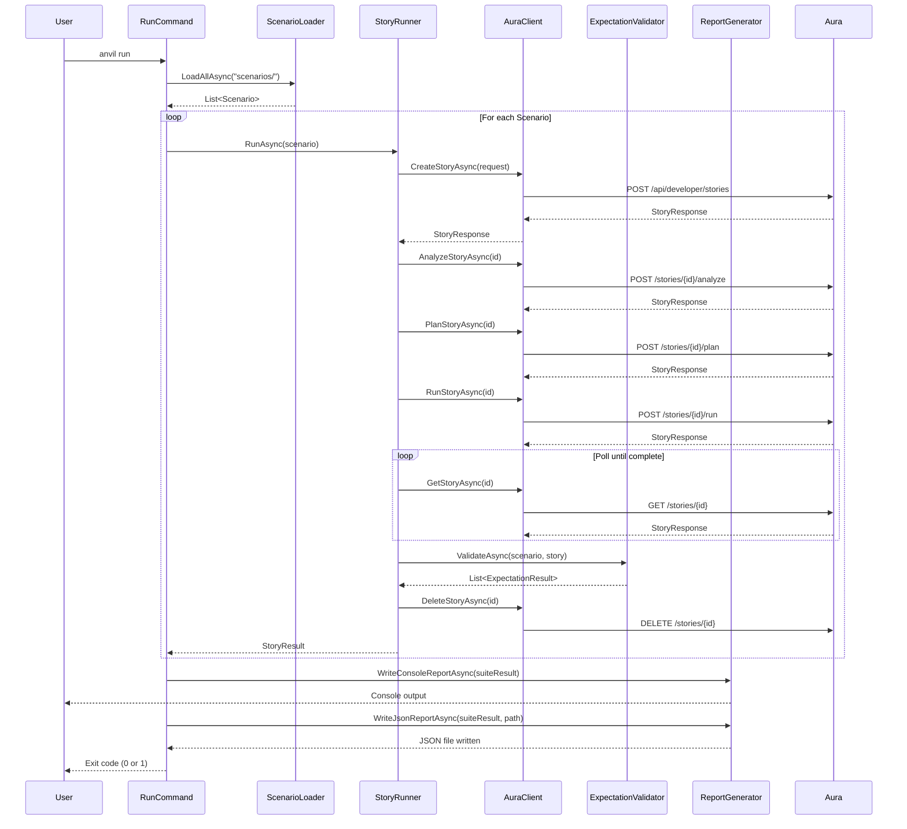

# Implementation Plan: Anvil Core

## Date
2026-01-30

## Research Reference
[research-aura-integration-2026-01-30.md](../research/research-aura-integration-2026-01-30.md)

---

## Non-Technical Specification

### Problem Statement

Aura generates code through AI agents, but there's no automated way to verify that the generated code is correct. Manual testing is slow, inconsistent, and doesn't catch regressions. We need a test harness that can run predefined scenarios against Aura and verify the output compiles and passes tests.

### Current State

- Aura has a fully functional Story API for creating and executing development workflows
- No automated testing exists for agent output quality
- Quality validation is manual and ad-hoc

### Desired Future State

- Developer runs `anvil run` to execute all test scenarios
- Each scenario creates a story in Aura, executes it, and verifies results
- Clear pass/fail output shows which scenarios succeeded
- JSON report captures detailed results for analysis
- Failures indicate Aura bugs that need fixing

### Success Criteria

1. CLI can run a single scenario: `anvil run scenarios/csharp/add-validation.yaml`
2. CLI can run all scenarios: `anvil run`
3. Console shows pass/fail for each scenario with timing
4. JSON report written to `reports/` directory
5. Exit code 0 = all pass, non-zero = failures exist
6. Scenarios define expected outcomes (compiles, tests pass, file exists)

### Out of Scope

- Parallel execution (per ADR-011)
- Retry logic (per ADR-012)
- CI integration formats (per ADR-013)
- Direct worktree management (per ADR-010)
- Build/test invocation (per ADR-015)

---

## Technical Specification

### Component: IAuraClient

**Type**: Interface (Port)
**Location**: `src/Anvil.Cli/Adapters/IAuraClient.cs`
**Responsibility**: Define contract for Aura API communication

**Interface**:
```csharp
public interface IAuraClient
{
    Task<bool> HealthCheckAsync(CancellationToken ct = default);
    Task<StoryResponse> CreateStoryAsync(CreateStoryRequest request, CancellationToken ct = default);
    Task<StoryResponse> GetStoryAsync(Guid id, CancellationToken ct = default);
    Task<StoryResponse> AnalyzeStoryAsync(Guid id, CancellationToken ct = default);
    Task<StoryResponse> PlanStoryAsync(Guid id, CancellationToken ct = default);
    Task<StoryResponse> RunStoryAsync(Guid id, CancellationToken ct = default);
    Task DeleteStoryAsync(Guid id, CancellationToken ct = default);
}
```

**Dependencies**: None (interface only)

**Error Cases**:
- Aura not running → `AuraUnavailableException`
- Story not found → `StoryNotFoundException`
- HTTP errors → `AuraApiException`

---

### Component: AuraClient

**Type**: Adapter (HTTP Client)
**Location**: `src/Anvil.Cli/Adapters/AuraClient.cs`
**Responsibility**: HTTP communication with Aura API

**Interface**:
```csharp
public sealed class AuraClient : IAuraClient
{
    public AuraClient(HttpClient httpClient, ILogger<AuraClient> logger);
    
    // Implements IAuraClient
}
```

**Dependencies**:
- `HttpClient`: For HTTP calls to Aura
- `ILogger<AuraClient>`: For request/response logging

**Error Cases**:
- Connection refused → `AuraUnavailableException`
- 404 response → `StoryNotFoundException`
- 4xx/5xx responses → `AuraApiException` with details

---

### Component: IScenarioLoader

**Type**: Interface (Port)
**Location**: `src/Anvil.Cli/Services/IScenarioLoader.cs`
**Responsibility**: Define contract for loading test scenarios

**Interface**:
```csharp
public interface IScenarioLoader
{
    Task<IReadOnlyList<Scenario>> LoadAllAsync(string scenariosPath, CancellationToken ct = default);
    Task<Scenario> LoadAsync(string filePath, CancellationToken ct = default);
}
```

**Dependencies**: None (interface only)

---

### Component: ScenarioLoader

**Type**: Service
**Location**: `src/Anvil.Cli/Services/ScenarioLoader.cs`
**Responsibility**: Load and parse YAML scenario files

**Interface**:
```csharp
public sealed class ScenarioLoader : IScenarioLoader
{
    public ScenarioLoader(IFileSystem fileSystem, ILogger<ScenarioLoader> logger);
    
    // Implements IScenarioLoader
}
```

**Dependencies**:
- `IFileSystem`: File system abstraction (System.IO.Abstractions)
- `ILogger<ScenarioLoader>`: For logging parse errors
- YamlDotNet: For YAML parsing

**Error Cases**:
- File not found → `ScenarioNotFoundException`
- Invalid YAML → `ScenarioParseException`
- Missing required fields → `ScenarioValidationException`

---

### Component: IStoryRunner

**Type**: Interface (Port)
**Location**: `src/Anvil.Cli/Services/IStoryRunner.cs`
**Responsibility**: Define contract for running a story through Aura

**Interface**:
```csharp
public interface IStoryRunner
{
    Task<StoryResult> RunAsync(Scenario scenario, RunOptions options, CancellationToken ct = default);
}

public record RunOptions(
    TimeSpan Timeout,
    TimeSpan PollInterval);
```

**Dependencies**: None (interface only)

---

### Component: StoryRunner

**Type**: Service
**Location**: `src/Anvil.Cli/Services/StoryRunner.cs`
**Responsibility**: Orchestrate story execution through Aura API

**Interface**:
```csharp
public sealed class StoryRunner : IStoryRunner
{
    public StoryRunner(
        IAuraClient auraClient,
        IExpectationValidator validator,
        ILogger<StoryRunner> logger);
    
    // Implements IStoryRunner
}
```

**Dependencies**:
- `IAuraClient`: For Aura API calls
- `IExpectationValidator`: For validating story results
- `ILogger<StoryRunner>`: For execution logging

**Error Cases**:
- Aura unavailable → Propagate `AuraUnavailableException`
- Timeout → `StoryTimeoutException`
- Story failed → Return `StoryResult` with failure details

---

### Component: IExpectationValidator

**Type**: Interface (Port)
**Location**: `src/Anvil.Cli/Services/IExpectationValidator.cs`
**Responsibility**: Validate story results against expectations

**Interface**:
```csharp
public interface IExpectationValidator
{
    Task<IReadOnlyList<ExpectationResult>> ValidateAsync(
        Scenario scenario,
        StoryResponse story,
        CancellationToken ct = default);
}
```

---

### Component: ExpectationValidator

**Type**: Service
**Location**: `src/Anvil.Cli/Services/ExpectationValidator.cs`
**Responsibility**: Check if story results meet scenario expectations

**Interface**:
```csharp
public sealed class ExpectationValidator : IExpectationValidator
{
    public ExpectationValidator(IFileSystem fileSystem, ILogger<ExpectationValidator> logger);
    
    // Implements IExpectationValidator
}
```

**Supported Expectations**:
- `compiles`: Story completed without build errors
- `tests_pass`: All tests passed
- `file_exists`: Specific file exists in worktree
- `file_contains`: File contains expected pattern

**Dependencies**:
- `IFileSystem`: For file existence/content checks
- `ILogger<ExpectationValidator>`: For validation logging

---

### Component: IReportGenerator

**Type**: Interface (Port)
**Location**: `src/Anvil.Cli/Services/IReportGenerator.cs`
**Responsibility**: Define contract for generating reports

**Interface**:
```csharp
public interface IReportGenerator
{
    Task WriteConsoleReportAsync(SuiteResult result, CancellationToken ct = default);
    Task WriteJsonReportAsync(SuiteResult result, string outputPath, CancellationToken ct = default);
}
```

---

### Component: ReportGenerator

**Type**: Service
**Location**: `src/Anvil.Cli/Services/ReportGenerator.cs`
**Responsibility**: Generate console and JSON reports

**Interface**:
```csharp
public sealed class ReportGenerator : IReportGenerator
{
    public ReportGenerator(IAnsiConsole console, IFileSystem fileSystem);
    
    // Implements IReportGenerator
}
```

**Dependencies**:
- `IAnsiConsole`: Spectre.Console for rich output
- `IFileSystem`: For writing JSON files

---

### Component: CLI Commands

**Type**: CLI (Spectre.Console.Cli)
**Location**: `src/Anvil.Cli/Commands/`
**Responsibility**: User interface for Anvil

**Commands**:

```csharp
// RunCommand.cs
[Description("Run test scenarios against Aura")]
public sealed class RunCommand : AsyncCommand<RunCommand.Settings>
{
    public sealed class Settings : CommandSettings
    {
        [CommandArgument(0, "[path]")]
        [Description("Scenario file or directory (default: ./scenarios/)")]
        public string? Path { get; init; }
        
        [CommandOption("-o|--output")]
        [Description("JSON report output path (default: ./reports/anvil-{timestamp}.json)")]
        public string? OutputPath { get; init; }
        
        [CommandOption("--url")]
        [Description("Aura API URL (default: $AURA_URL or http://localhost:5300)")]
        public string? AuraUrl { get; init; }
        
        [CommandOption("-t|--timeout")]
        [Description("Story timeout in seconds (default: 300)")]
        public int Timeout { get; init; } = 300;
        
        [CommandOption("-q|--quiet")]
        [Description("Quiet mode: show summary only")]
        public bool Quiet { get; init; }
        
        [CommandOption("--silent")]
        [Description("Silent mode: exit code only (implies -q)")]
        public bool Silent { get; init; }
    }
}

// ValidateCommand.cs
[Description("Validate scenario files without running")]
public sealed class ValidateCommand : AsyncCommand<ValidateCommand.Settings>
{
    public sealed class Settings : CommandSettings
    {
        [CommandArgument(0, "[path]")]
        public string? Path { get; init; }
    }
}

// HealthCommand.cs
[Description("Check Aura API health")]
public sealed class HealthCommand : AsyncCommand
{
}
```

---

## Data Models

### Location: `src/Anvil.Cli/Models/`

```csharp
// Scenario.cs
public sealed record Scenario
{
    public required string Name { get; init; }
    public required string Description { get; init; }
    public required string Language { get; init; }
    public required string Repository { get; init; }
    public required StoryDefinition Story { get; init; }
    public required IReadOnlyList<Expectation> Expectations { get; init; }
    public int TimeoutSeconds { get; init; } = 300;
    public IReadOnlyList<string> Tags { get; init; } = [];
    
    // Metadata (set by loader)
    public string? FilePath { get; init; }
}

public sealed record StoryDefinition
{
    public required string Title { get; init; }
    public required string Description { get; init; }
}

public sealed record Expectation
{
    public required string Type { get; init; }  // compiles, tests_pass, file_exists, file_contains
    public required string Description { get; init; }
    public string? Path { get; init; }          // For file_exists, file_contains
    public string? Pattern { get; init; }       // For file_contains (regex)
}

// Results
public sealed record StoryResult
{
    public required Scenario Scenario { get; init; }
    public required bool Success { get; init; }
    public required TimeSpan Duration { get; init; }
    public Guid? StoryId { get; init; }
    public string? WorktreePath { get; init; }
    public string? Error { get; init; }
    public IReadOnlyList<ExpectationResult> ExpectationResults { get; init; } = [];
}

public sealed record ExpectationResult
{
    public required Expectation Expectation { get; init; }
    public required bool Passed { get; init; }
    public string? Message { get; init; }
}

public sealed record SuiteResult
{
    public required IReadOnlyList<StoryResult> Results { get; init; }
    public required TimeSpan TotalDuration { get; init; }
    public required DateTimeOffset StartedAt { get; init; }
    public required DateTimeOffset CompletedAt { get; init; }
    
    public int Passed => Results.Count(r => r.Success);
    public int Failed => Results.Count(r => !r.Success);
    public int Total => Results.Count;
}

// API Contracts (mirror Aura's API)
public sealed record CreateStoryRequest
{
    public required string Title { get; init; }
    public required string Description { get; init; }
    public required string RepositoryPath { get; init; }
    public string AutomationMode { get; init; } = "Autonomous";
}

public sealed record StoryResponse
{
    public required Guid Id { get; init; }
    public required string Title { get; init; }
    public string? Description { get; init; }
    public required string Status { get; init; }
    public string? WorktreePath { get; init; }
    public string? GitBranch { get; init; }
    public IReadOnlyList<StepResponse>? Steps { get; init; }
    public string? Error { get; init; }
}

public sealed record StepResponse
{
    public required Guid Id { get; init; }
    public required int Order { get; init; }
    public required string Name { get; init; }
    public required string Status { get; init; }
    public string? Output { get; init; }
    public string? Error { get; init; }
}
```

---

## File Changes

### New Files

| File Path | Type | Purpose |
|-----------|------|---------|
| `src/Anvil.Cli/Anvil.Cli.csproj` | Project | CLI project file |
| `src/Anvil.Cli/Program.cs` | Entry | Application entry point |
| `src/Anvil.Cli/Commands/RunCommand.cs` | Command | Run scenarios |
| `src/Anvil.Cli/Commands/ValidateCommand.cs` | Command | Validate scenarios |
| `src/Anvil.Cli/Commands/HealthCommand.cs` | Command | Check Aura health |
| `src/Anvil.Cli/Adapters/IAuraClient.cs` | Interface | Aura API contract |
| `src/Anvil.Cli/Adapters/AuraClient.cs` | Adapter | HTTP client for Aura |
| `src/Anvil.Cli/Services/IScenarioLoader.cs` | Interface | Scenario loading contract |
| `src/Anvil.Cli/Services/ScenarioLoader.cs` | Service | YAML scenario loader |
| `src/Anvil.Cli/Services/IStoryRunner.cs` | Interface | Story runner contract |
| `src/Anvil.Cli/Services/StoryRunner.cs` | Service | Story execution orchestrator |
| `src/Anvil.Cli/Services/IExpectationValidator.cs` | Interface | Validation contract |
| `src/Anvil.Cli/Services/ExpectationValidator.cs` | Service | Result validation |
| `src/Anvil.Cli/Services/IReportGenerator.cs` | Interface | Report generation contract |
| `src/Anvil.Cli/Services/ReportGenerator.cs` | Service | Console + JSON reports |
| `src/Anvil.Cli/Models/Scenario.cs` | Model | Scenario data structures |
| `src/Anvil.Cli/Models/Results.cs` | Model | Result data structures |
| `src/Anvil.Cli/Models/ApiContracts.cs` | Model | Aura API DTOs |
| `src/Anvil.Cli/Exceptions/AnvilExceptions.cs` | Exceptions | Custom exception types |
| `tests/Anvil.Cli.Tests/Anvil.Cli.Tests.csproj` | Project | Test project file |
| `tests/Anvil.Cli.Tests/Services/ScenarioLoaderTests.cs` | Test | Scenario loader tests |
| `tests/Anvil.Cli.Tests/Services/StoryRunnerTests.cs` | Test | Story runner tests |
| `tests/Anvil.Cli.Tests/Services/ExpectationValidatorTests.cs` | Test | Validator tests |
| `tests/Anvil.Cli.Tests/Services/ReportGeneratorTests.cs` | Test | Report tests |
| `tests/Anvil.Cli.Tests/Adapters/AuraClientTests.cs` | Test | API client tests |
| `tests/Anvil.Cli.Tests/Fakes/FakeAuraClient.cs` | Fake | Test double for Aura |
| `anvil/scenarios/csharp/hello-world.yaml` | Fixture | Sample C# scenario |
| `anvil/scenarios/README.md` | Docs | Scenario format documentation |

### Modified Files

| File Path | Changes |
|-----------|---------|
| `Anvil.sln` | Add Anvil.Cli and Anvil.Cli.Tests projects |

---

## Dependency Wiring

### Production (in Program.cs)

```csharp
var services = new ServiceCollection();

// Logging
services.AddLogging(builder => builder.AddConsole());

// File system abstraction
services.AddSingleton<IFileSystem, FileSystem>();

// HTTP client for Aura
services.AddHttpClient<IAuraClient, AuraClient>(client =>
{
    client.BaseAddress = new Uri("http://localhost:5300");
    client.Timeout = TimeSpan.FromMinutes(10);
});

// Services
services.AddSingleton<IScenarioLoader, ScenarioLoader>();
services.AddSingleton<IStoryRunner, StoryRunner>();
services.AddSingleton<IExpectationValidator, ExpectationValidator>();
services.AddSingleton<IReportGenerator, ReportGenerator>();
services.AddSingleton<IAnsiConsole>(AnsiConsole.Console);

var provider = services.BuildServiceProvider();
```

### Test (in test files)

```csharp
var fakeAura = new FakeAuraClient();
var fakeFileSystem = new MockFileSystem();
var logger = NullLogger<StoryRunner>.Instance;

var runner = new StoryRunner(fakeAura, validator, logger);
```

---

## Test Cases

### Unit Tests: ScenarioLoader

| Test Name | Tests That | Input | Expected Output |
|-----------|------------|-------|-----------------|
| `LoadAsync_WithValidYaml_ReturnsScenario` | Happy path | Valid YAML | Scenario object |
| `LoadAsync_WithMissingName_ThrowsValidationException` | Required field | YAML without name | ScenarioValidationException |
| `LoadAsync_WithInvalidYaml_ThrowsParseException` | Malformed YAML | Invalid YAML | ScenarioParseException |
| `LoadAsync_WithMissingFile_ThrowsNotFoundException` | File not found | Bad path | ScenarioNotFoundException |
| `LoadAllAsync_WithDirectory_ReturnsAllScenarios` | Directory loading | Dir path | List of scenarios |
| `LoadAllAsync_WithEmptyDirectory_ReturnsEmpty` | Empty case | Empty dir | Empty list |

### Unit Tests: StoryRunner

| Test Name | Tests That | Input | Expected Output |
|-----------|------------|-------|-----------------|
| `RunAsync_WithSuccessfulStory_ReturnsSuccess` | Happy path | Valid scenario | StoryResult.Success = true |
| `RunAsync_WithFailedStory_ReturnsFailure` | Story failure | Story that fails | StoryResult.Success = false |
| `RunAsync_WithTimeout_ThrowsTimeoutException` | Timeout handling | Long-running story | StoryTimeoutException |
| `RunAsync_WithAuraDown_ThrowsUnavailable` | Aura offline | Aura not running | AuraUnavailableException |
| `RunAsync_CallsAnalyzePlanRun_InOrder` | Lifecycle | Any scenario | API calls in order |
| `RunAsync_DeletesStoryOnCompletion` | Cleanup | Any scenario | Delete called |
| `RunAsync_DeletesStoryOnFailure` | Cleanup on error | Failing scenario | Delete called |

### Unit Tests: ExpectationValidator

| Test Name | Tests That | Input | Expected Output |
|-----------|------------|-------|-----------------|
| `ValidateAsync_Compiles_WhenCompleted_Passes` | Compile check | Status=Completed | Passed=true |
| `ValidateAsync_Compiles_WhenFailed_Fails` | Compile check | Status=Failed | Passed=false |
| `ValidateAsync_TestsPass_WhenNoFailures_Passes` | Test check | All steps passed | Passed=true |
| `ValidateAsync_FileExists_WhenPresent_Passes` | File check | File exists | Passed=true |
| `ValidateAsync_FileExists_WhenMissing_Fails` | File check | File missing | Passed=false |
| `ValidateAsync_FileContains_WhenMatches_Passes` | Pattern check | Pattern found | Passed=true |
| `ValidateAsync_FileContains_WhenNoMatch_Fails` | Pattern check | No match | Passed=false |

### Unit Tests: ReportGenerator

| Test Name | Tests That | Input | Expected Output |
|-----------|------------|-------|-----------------|
| `WriteConsoleReport_WithPasses_ShowsGreen` | Success display | All pass | Green checkmarks |
| `WriteConsoleReport_WithFailures_ShowsRed` | Failure display | Has failures | Red X marks |
| `WriteJsonReport_WritesValidJson` | JSON output | Suite result | Valid JSON file |
| `WriteJsonReport_IncludesAllResults` | Completeness | Suite result | All results in JSON |

### Unit Tests: AuraClient

| Test Name | Tests That | Input | Expected Output |
|-----------|------------|-------|-----------------|
| `HealthCheckAsync_WhenHealthy_ReturnsTrue` | Health check | 200 response | true |
| `HealthCheckAsync_WhenUnhealthy_ReturnsFalse` | Health check | 500 response | false |
| `CreateStoryAsync_ReturnsStory` | Create | Valid request | StoryResponse |
| `GetStoryAsync_WhenNotFound_Throws` | 404 handling | Bad ID | StoryNotFoundException |

---

## Architecture Diagram



---

## Sequence Diagram



---

## Implementation Order

Following TDD and dependency order:

### Phase 1: Foundation (Day 1)

1. **Create project structure**
   - Create `Anvil.Cli.csproj` with dependencies
   - Create `Anvil.Cli.Tests.csproj` with test frameworks
   - Add both to solution

2. **Create data models**
   - `Scenario.cs` with all records
   - `Results.cs` with result records
   - `ApiContracts.cs` with Aura DTOs
   - `AnvilExceptions.cs` with custom exceptions

### Phase 2: Scenario Loading (Day 2)

3. **Interface: IScenarioLoader**
   - Create interface definition

4. **Tests: ScenarioLoaderTests**
   - Write all failing tests with fake file system

5. **Implementation: ScenarioLoader**
   - Implement to make tests pass

### Phase 3: Aura Client (Day 2-3)

6. **Interface: IAuraClient**
   - Create interface definition

7. **Fake: FakeAuraClient**
   - Create test double

8. **Tests: AuraClientTests**
   - Write tests with MockHttpMessageHandler

9. **Implementation: AuraClient**
   - Implement HTTP client

### Phase 4: Story Runner (Day 3)

10. **Interface: IExpectationValidator**
    - Create interface

11. **Tests: ExpectationValidatorTests**
    - Write failing tests

12. **Implementation: ExpectationValidator**
    - Implement validation logic

13. **Interface: IStoryRunner**
    - Create interface

14. **Tests: StoryRunnerTests**
    - Write failing tests with fakes

15. **Implementation: StoryRunner**
    - Implement orchestration

### Phase 5: Reporting (Day 4)

16. **Interface: IReportGenerator**
    - Create interface

17. **Tests: ReportGeneratorTests**
    - Write failing tests

18. **Implementation: ReportGenerator**
    - Implement console + JSON output

### Phase 6: CLI Commands (Day 4)

19. **CLI: Program.cs**
    - Set up Spectre.Console.Cli
    - Wire up DI container

20. **CLI: HealthCommand**
    - Implement health check command

21. **CLI: ValidateCommand**
    - Implement scenario validation

22. **CLI: RunCommand**
    - Implement main run command

### Phase 7: Sample Scenario (Day 5)

23. **Fixture: hello-world.yaml**
    - Create minimal C# scenario

24. **Docs: scenarios/README.md**
    - Document scenario format

25. **Integration Test**
    - Manual end-to-end test with running Aura

---

## Resolved Design Decisions

### 1. Base URL Configuration
**Decision**: Layered precedence - `--url` flag → `AURA_URL` env var → `http://localhost:5300` hardcoded fallback.

```bash
# Default (hardcoded fallback)
anvil run

# Environment variable
$env:AURA_URL = "http://192.168.1.5:5300"
anvil run

# CLI flag (highest precedence)
anvil run --url http://localhost:5301
```

### 2. Scenario Discovery
**Decision**: Auto-discover from current working directory. Look for `./scenarios/` by default, allow explicit path override.

```bash
# Auto-discover
anvil run
# → Finds ./scenarios/**/*.yaml

# Explicit path
anvil run ./custom/scenarios
```

### 3. Report Output Path
**Decision**: Write to `./reports/anvil-{timestamp}.json` by default (create directory if missing). Override with `--output`.

```bash
# Default
anvil run
# → Writes ./reports/anvil-2026-01-30T14-30-00.json

# Explicit
anvil run --output ./custom/report.json
```

### 4. Output Verbosity (Console vs Logs)

**Console output** (real-time feedback):

| Flag | Name | Shows |
|------|------|-------|
| (none) | Verbose | Full progress, step details, agent output |
| `-q` | Quiet | Summary: pass/fail per scenario |
| `-qq` | Silent | Exit code only (for automation) |

**Log file** (always verbose, separate from console):
- Always written to `./logs/anvil-{timestamp}.log`
- Contains full details regardless of console verbosity
- Timestamps, API requests/responses, agent output, stack traces

```bash
# Interactive - verbose console
anvil run

# CI/automation - silent console, full logs
anvil run -qq
# Exit code: 1
# Details in: ./logs/anvil-2026-01-30T14-30-00.log
```

---

## Execution Instructions

To implement this plan:

1. Read this entire plan document
2. Confirm all open questions are resolved
3. Run `.sdd/prompts/implement.md` with this plan as input
4. Follow the implementation order exactly
5. Do not skip TDD steps (tests first, then code)
6. Run `dotnet test` after each component to verify

---

## Handoff to Implementation

### Ready for Implementation: ✅

**Files to Create**: 27 new files
**Files to Modify**: 1 existing file (Anvil.sln)
**Test Cases**: 28 tests specified
**Fakes Required**: 1 fake (FakeAuraClient)

### Implementation Order Summary

1. Project structure + data models
2. ScenarioLoader (interface → tests → impl)
3. AuraClient (interface → fake → tests → impl)
4. ExpectationValidator (interface → tests → impl)
5. StoryRunner (interface → tests → impl)
6. ReportGenerator (interface → tests → impl)
7. CLI commands (Program → Health → Validate → Run)
8. Sample scenario + integration test

### Blocking Issues
- None

---

## ADR: Design Decisions

These decisions have been recorded as ADR-016 for reference:

| Decision | Choice |
|----------|--------|
| Base URL | `--url` → `AURA_URL` env → `localhost:5300` fallback |
| Scenario discovery | Auto-discover `./scenarios/` from CWD |
| Report output | `./reports/anvil-{timestamp}.json` default |
| Console verbosity | Verbose default, `-q` quiet, `-qq` silent |
| Log verbosity | Always verbose to `./logs/anvil-{timestamp}.log` |

---

## Checklist

- [x] All acceptance criteria mapped to test cases
- [x] All new components have interface specifications
- [x] Dependency flow follows architecture rules (CLI → Services → Adapters)
- [x] Fakes planned for all adapters
- [x] Error cases identified and handled
- [x] Non-technical spec is understandable by non-engineers
- [x] At least one mermaid diagram included
- [x] Implementation order follows TDD (tests before implementation)
- [x] File paths are specific and complete
